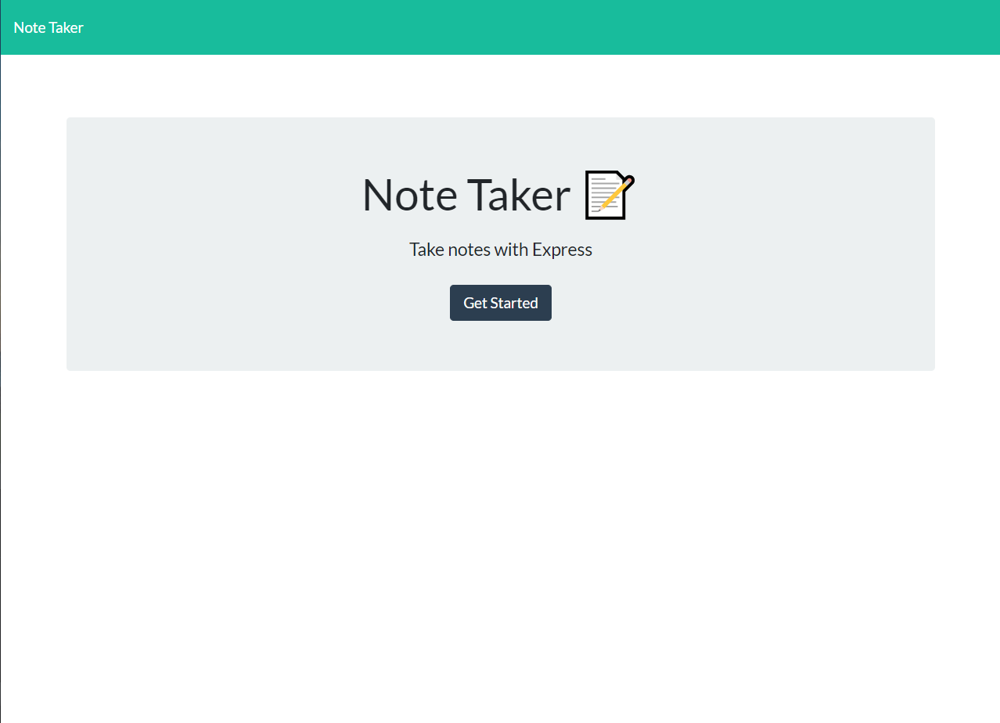
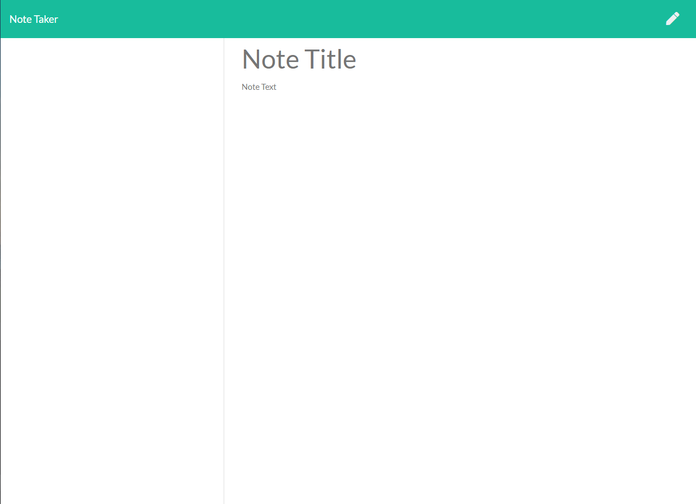
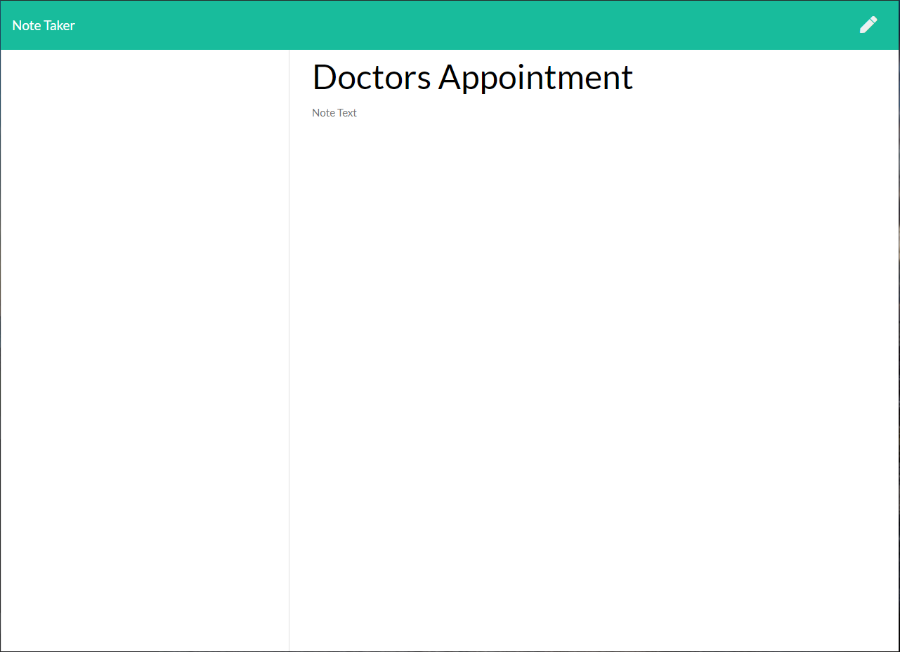
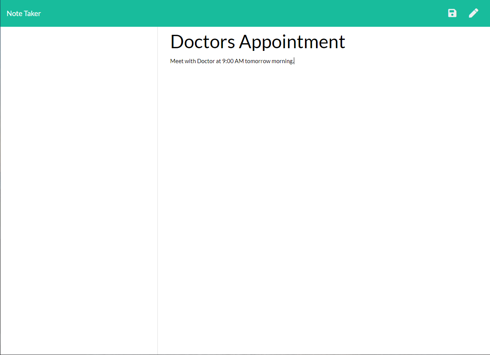
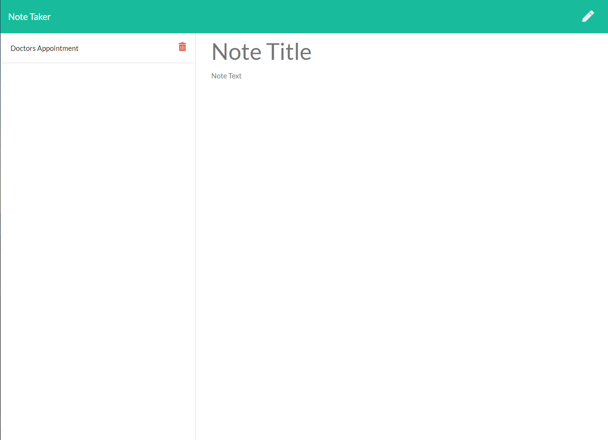
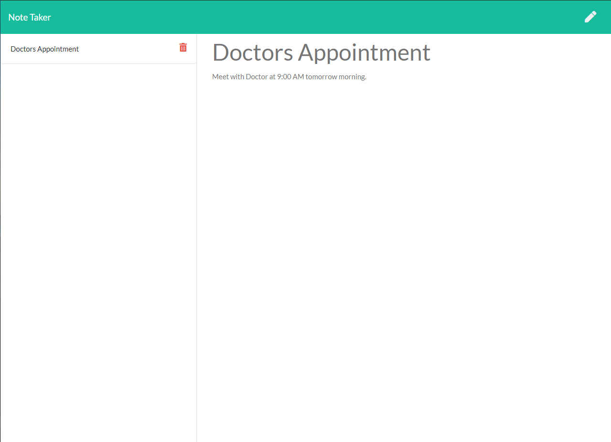
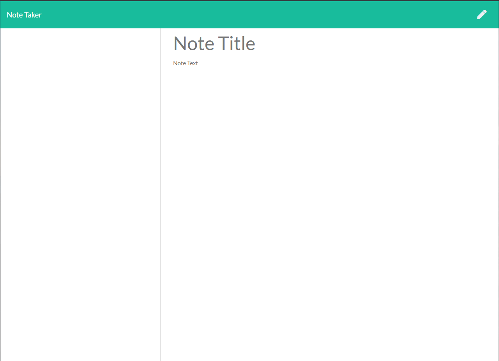

# Note Taker 

## Links

Repository Link: https://github.com/masonmarinko/note-taker

Website Link: https://salty-inlet-04828.herokuapp.com/

## Description

Note taking app that allows you to put a title and description of a task. After being saved the previous notes will be stored in the left hand column, the user has the ability to then delete the note once done or if the user no longer wants it.

## Table of Contents
* [Usage](#usage)
* [License](#license)
* [Questions](#questions)

## Usage (After Installation)

1) User is greeted with a simple home page that has a button saying "Get Started". Once the button is selected they are redirected.

2) Once the "Get Started" button is selected they are taken to the "notes" home page. The user can type in a "Note Title" as well as "Note Text" below that. There is also a button in the corner that allows the user to restart their note if there is a mistake or they change their mind.

3) Once the user starts to enter information a "save" button will not appear until the user has put in both the "Note Title" as well as the "Note Text"

4) This is what is looks like after the user has entered the required information. The save button appears in the upper right hand corner next to the pencil.

5) Once the note is saved it will be conveniently saved to the column on the left side, the user will have 2 options.

6) If the user wants they can select a previous note and see what it says. It will appear in the main panel when selected in lighter/locked lettering so to inform the user that it cannot be edited, however if they do select the red trash can beside the note....

7) The item they selected will be deleted and only any other notes (or none at all if no more than 1) will remain.

## License

This project is covered under the following license(s): MIT

GitHub Profile: [masonmarinko](https://github.com/masonmarinko)

Questions? <Mason.P.Marinko@gmail.com>